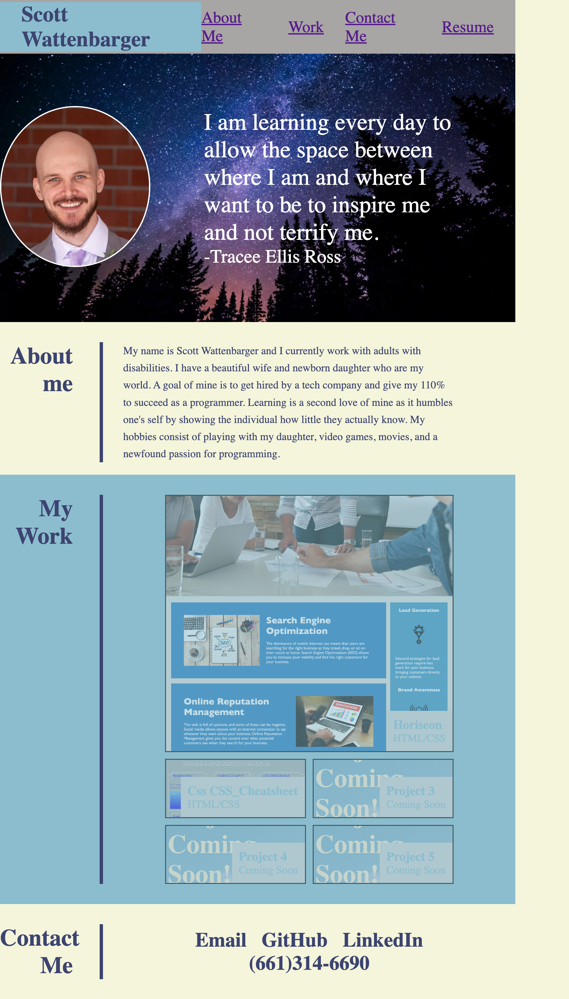
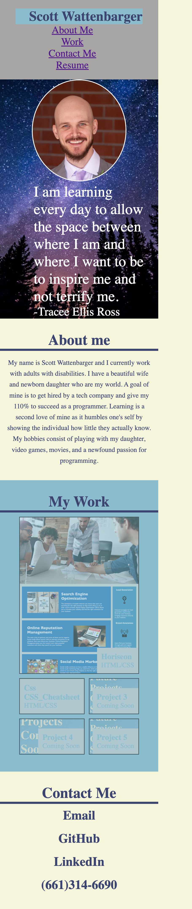

# Code Refactor Starter Code

In this Module 2 Challenge, I was assigned to read a user story and an acceptance criteria. I had to develop a portfolio that would display my name, picture, and links to sections about myself. I aslo had to make the website responsive to different viewports. This lesson taught me a lot about CSS and the capablities it has. Which is crazy because I haven't even scratched the surface of CSS's full capabilities.

## Acceptance Criteria

GIVEN I need to sample a potential employee's previous work

*WHEN I load their portfolio

THEN I am presented with the developer's name, a recent photo or avatar, and links to sections about them, their work, and how to contact them

*WHEN I click one of the links in the navigation

THEN the UI scrolls to the corresponding section

*WHEN I click on the link to the section about their work

THEN the UI scrolls to a section with titled images of the developer's applications

*WHEN I am presented with the developer's first application

THEN that application's image should be larger in size than the others

*WHEN I click on the images of the applications

THEN I am taken to that deployed application

*WHEN I resize the page or view the site on various screens and devices

THEN I am presented with a responsive layout that adapts to my viewport

## Work Completed

*Creates HTML layout in semantic HTML

*Adds my name to title

*Organizes CSS elements to logical structure

*Alphabetizes all CSS declarations

*Adds my name, my picture, about me, my work, resume, and contact me

*Responsive Navigation Bar

*Adds comments to describe CSS

*Adds alt attribute to images

*First application is larger than others

*Adds a tag with href to applications

*Makes the website responsive to different viewports

## Deployed Site

The deployed site hosted by GitHub.

https://scottwatt.github.io/Portfolio

## Screenshot

### Full page

### Tablet

### Phone
